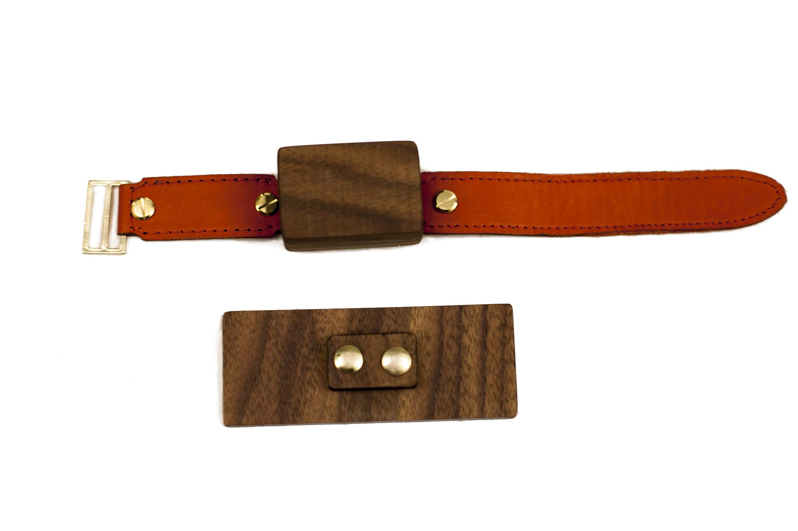
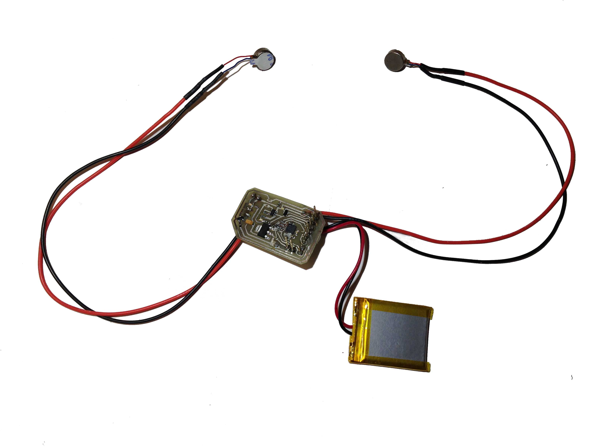
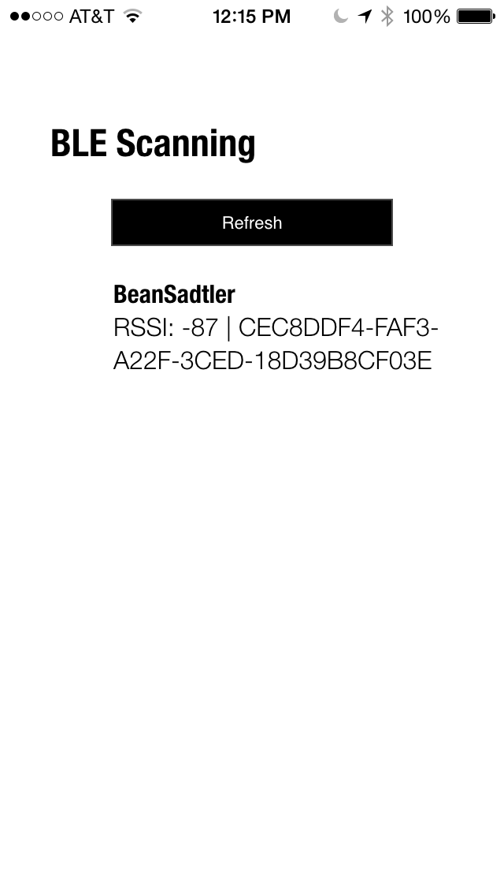
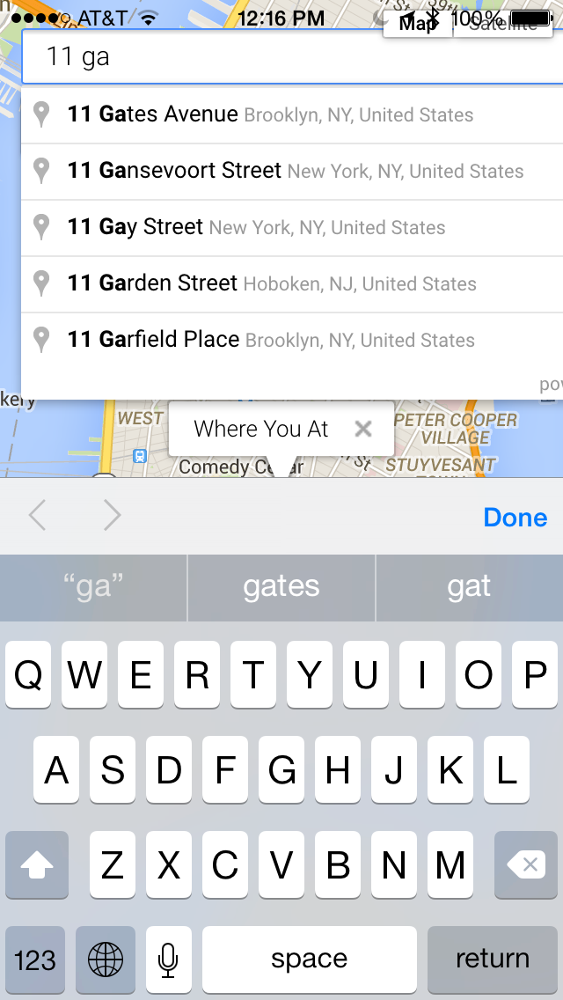
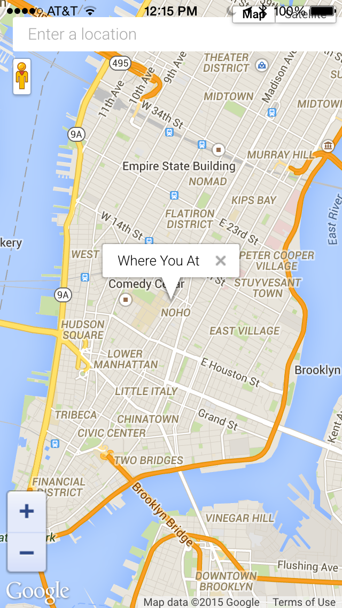

	<iframe width="100%" height="480" src="https://www.youtube.com/embed/JSgkgHqbBLo" frameborder="0" allowfullscreen></iframe>

	Whears is a device which enables its wearer to sense the direction of a loved one or place of interest through the use of vibration. The user enters a location through their smartphone and connects to the device through Bluetooth. When a location is entered the user receives a vibration on their wrist when they are facing the direction of that place. Thus enabling them to be reminded of that place throughout the day and have a constant reference point for when they are navigating. Or they can just change the location when they need to get to a new location. 

	

	

		Whears features a custom designed walnut, leather, and gold plated enclosure with a walnut and brass charging stand.
	
	

	

	

		There is also a custom made circuit board which integrates with a bluetooth enabled Arduino board, vibration motors and a 9 degrees of freedom circuit integrated circuit.
	

<Row>

	

	

	

