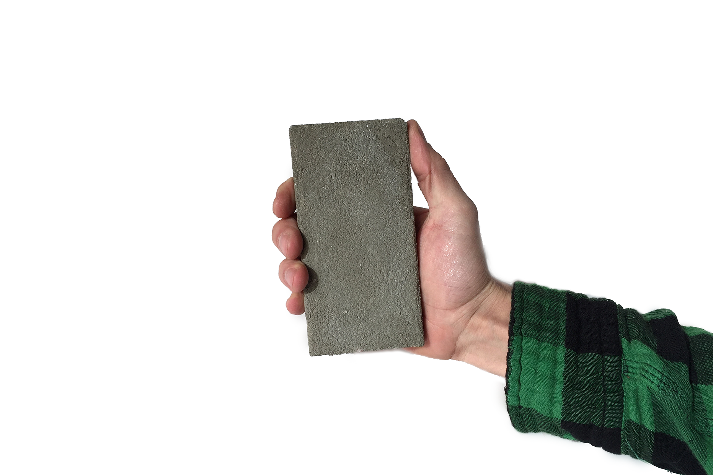
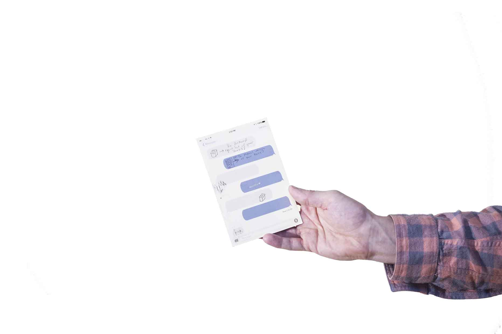
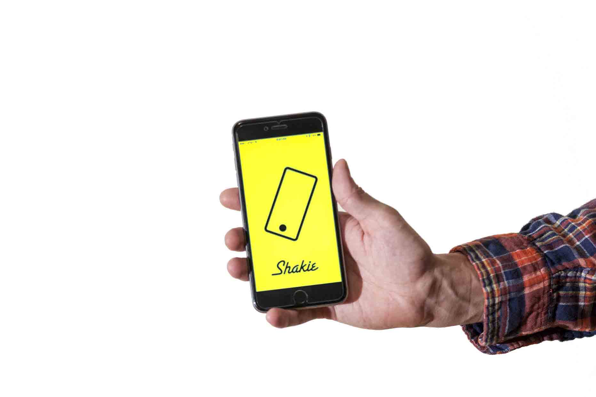
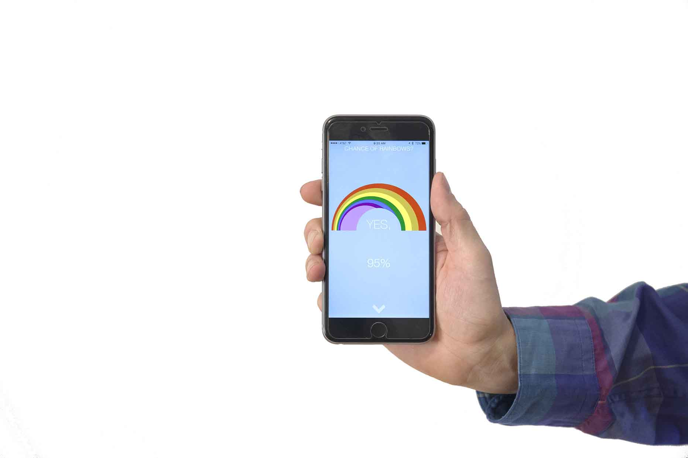
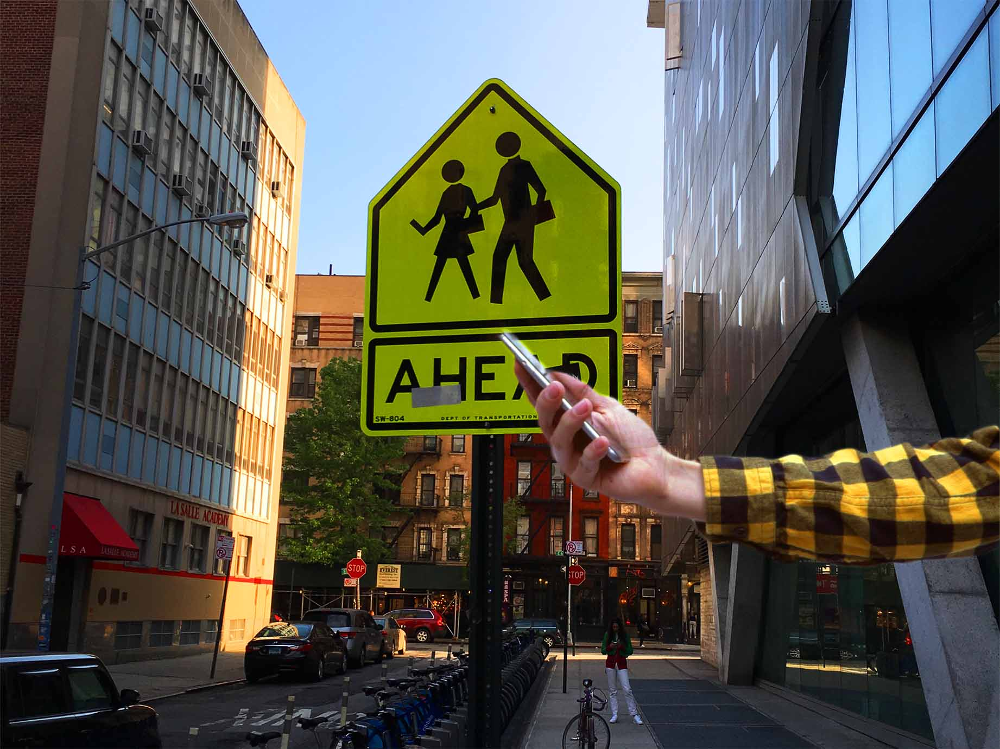

	

		

			The Zombie Self Awareness Kit is a series of 5 interventions designed to reanimate our selves and create awareness around our relationship to our smart phones. 
		

	

	<iframe src="https://player.vimeo.com/video/166993010" width="100%" height="360" frameborder="0" webkitallowfullscreen mozallowfullscreen allowfullscreen ></iframe>

	
	

		
	

	

		

			<h4> <a href="http://www.samsadtler.com/crete">Crete </a> </h4>
			is the first connected brick for the age of electronic homes and useless devices. It does everything you might want from a Fitbit and yet it is in a form factor that is unwieldy and impractical. It uses haptics to communicate to users when they are being unconscious.
		

	

	

		
	
	
	

		<h4> <a href="http://www.samsadtler.com/posttext">Post Text</a> </h4>
		is a way to give pause to text messages by creating a means to share a long conversation with a friend. It is about anticipation and excitement, yet fosters more attention and focus to the quality omitted from text messages, such as handwriting.
	

	

		
	

	

		<h4> <a href="http://www.samsadtler.com/shakie">Shakie Selfie</a> </h4> 
		makes life spontaneous again when you start taking selfies by shaking your phone. Share the moment with your friends and colleagues, by making fun of the beautiful moment of taking a selfie. (WARNING: likely to create artistically blurred photos)
	

	

		
	

	

		

			<h4> Chance of Rainbows </h4>
			is about re-framing our world view from relying on technology to manifesting a playful take on how we see the weather. So what if it's going to rain? There might be a rainbow. Calculating the angle of incidence of sunlight on rain into the human eye and then combining that information with time of day and weather predictions yields a new take on a drab subject. It might even get you to look away from your phone.
		

	

	
	

		
	

	

		<h4> Zombie Crossing </h4>
		Sign is an updated version of the standard pedestrian sign seen in use to today. It is my civic suggestion on how to update our dated infrastructure.			
	

