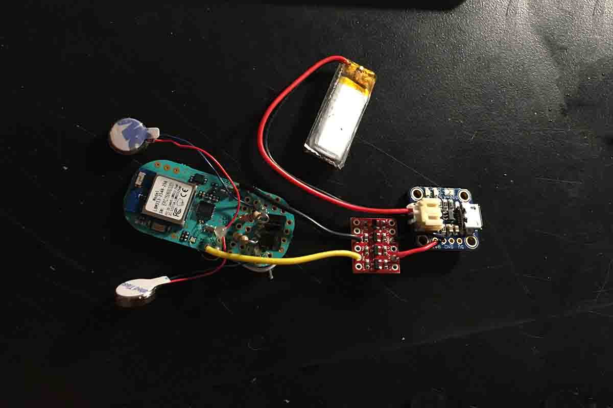
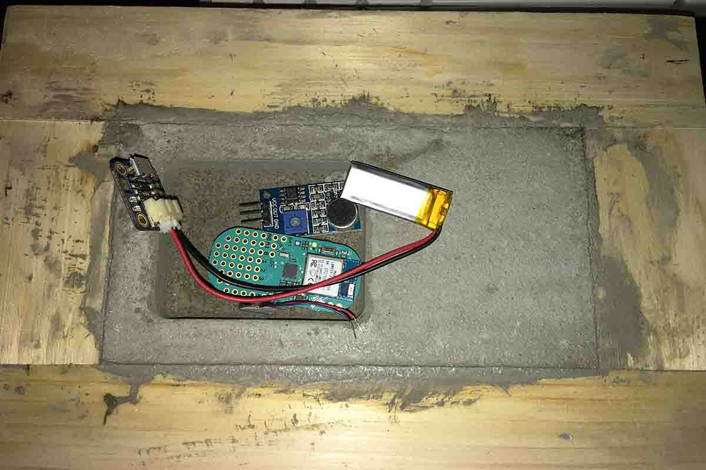
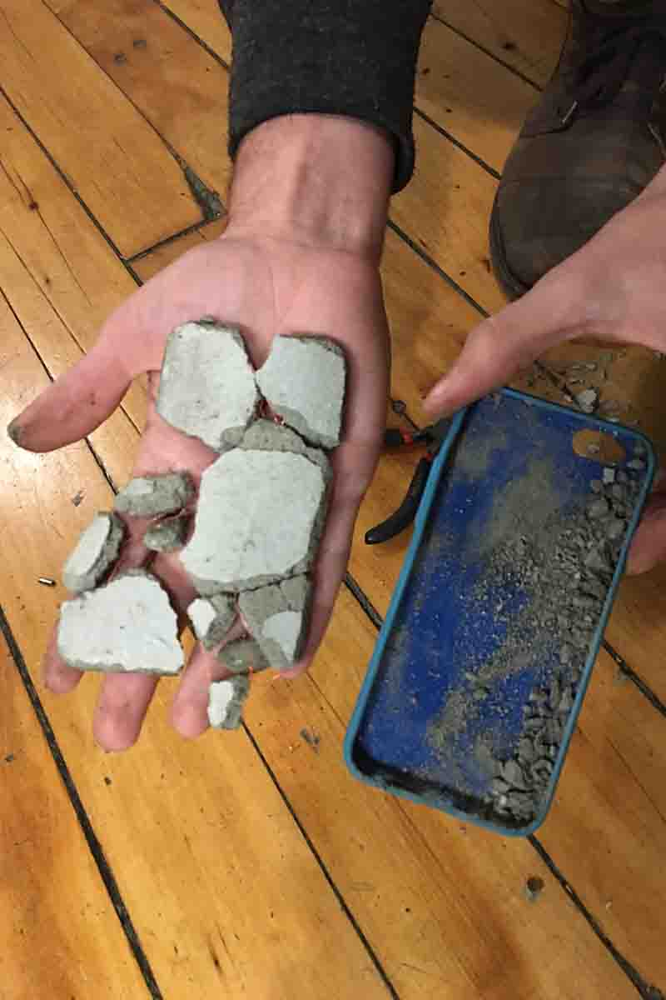
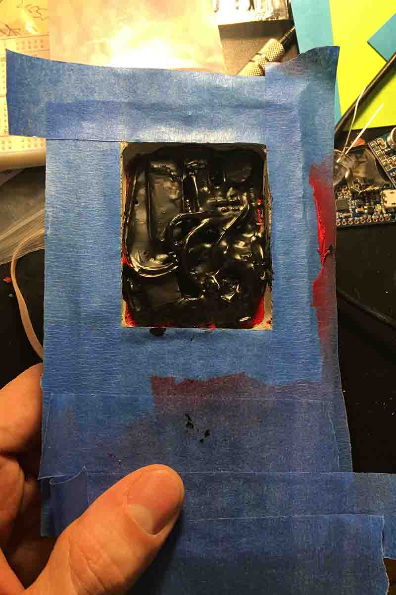

    

        <iframe class="embed-responsive-item" src="https://www.youtube.com/embed/hJkIgraE530" frameborder="0" allowfullscreen></iframe>
    

    

        
 Who knew organic material could be so useful? The first connected brick for the age of electronic homes and useless devices. It does everything you might want from a Fitbit and yet it is in a form factor that is unwieldy and impractical. It uses haptics to communicate to users when they are not mindful. Created in collaboration with <a href="oryano.com">Oryan Inbar</a>
        

    

	

    
    

        The completed circuit design to make sure that Crete worked as advertised. Features a <a href="https://punchthrough.com/bean">Light Blue Bean</a> with BLE, a 105mAh battery plus a voltage regulator and battery charger.
    
		

    
    

     approximates the amount of room the final circuit will take up in Crete.
    
		

    
    

        The initial attempt at making a concrete block which was relatively close to the form factor we wanted. The issue we ran into was that the block was to thin and we did not use enough mold release which resulted in the block breaking.
    

    
    

        A picture of the final product being created. The circuits have been encased in liquid tape to prevent moister from the curing process to effect the circuit.
    
		

    <iframe width="100%" height="480" src="https://www.youtube.com/embed/GyFxrQd7-zw?list=PLp1AzLEITCFxnF3zXRn5ZErynB5Vg5Ynr" frameborder="0" allowfullscreen></iframe>

