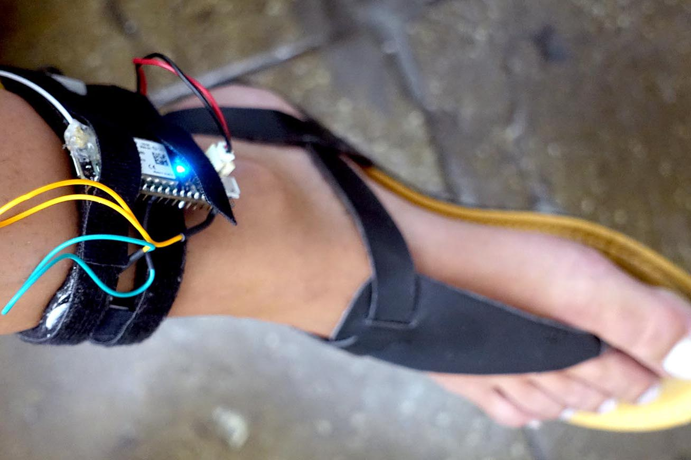

    <iframe width="1920" height="777" src="https://www.youtube.com/embed/MdDfAdSeRNQ" frameBorder="0" allow="accelerometer; autoplay; encrypted-media; gyroscope; picture-in-picture"></iframe>

    This wearable work explores ways to make technology enhance our senses. 
    <a href="http://oryano.com/"> Oryan Inbar </a> and I worked with
    <a href="http://cyborgarts.com/#moon-ribas"> Moon Ribas </a> and
    <a href="http://harbisson.com"> Neil Harbisson </a>
    to develop new senses for their cyborg selves at the
    <a href="https://thoughtworksarts.io/"> Thought Works Arts Residency</a>. I worked closely with Moon to develop a "Seismic Sense", a wearable which could enable her to experience earthquakes in real time. We also developed a "Sense of Time" for Neil which used heat to convey the time of day.

      

    

    Our initial plan was to place the electronics on top of Moon's food. However, though this simple layout test we were able to determine that the top of her foot was not the right place. Specifically, because during her performances she tended to use the tops of her feet. Thus this lead us to the conclusion that her ankle was the best place to locate her wearable sense.

    Above is the final prototype of Moon's Siesmic Sense. Utilizing the US Geological Survey's API we conveyed realtime information about earthquakes happening around the world using haptic feedback with a cellular enabled micro controller and vibration motors.

